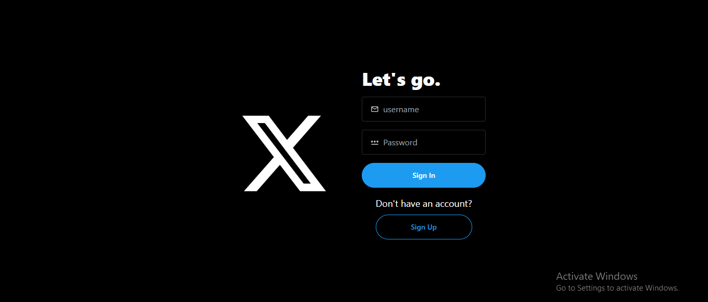
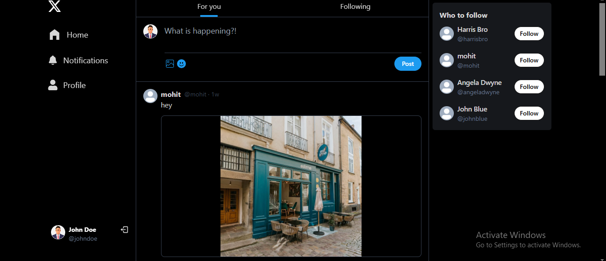
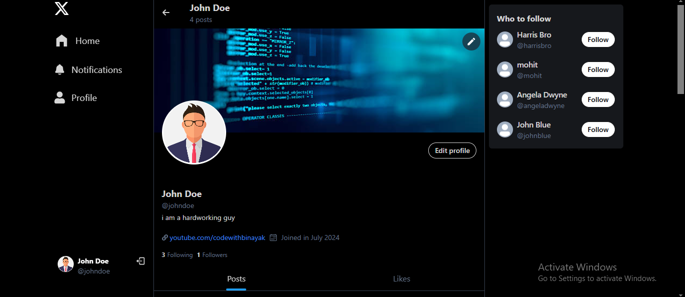

# X Clone - A Social Media Platform

X Clone is a fully functional social media platform built using the MERN stack. It allows users to create, share, and interact with posts, follow/unfollow other users, receive notifications, and much more.

## 📸 Screenshots

### 🔹 Login Page  


### 🔹 Home Page  


### 🔹 User Profile  


## 🚀 Features

-   🔐 Authentication
-   🔥 React Query for Data Fetching, Caching etc.
-   👥 Suggested Users to Follow
-   ✍️ Creating Posts
-   🗑️ Deleting Posts
-   💬 Commenting on Posts
-   ❤️ Liking Posts
-   🔒 Delete Posts (if you are the owner)
-   📝 Edit Profile Info
-   🖼️ Edit Cover Image and Profile Image
-   📷 Image Uploads using Cloudinary
-   🔔 Send Notifications
-   🌐 Deployment
-   ⚡**Environment Variables (.env)** for sensitive values management

## 🛠️ Tech Stack

- **Frontend:** React.js, React Query, Tailwind CSS
- **Backend:** Node.js, Express.js, MongoDB
- **Authentication:** JSON Web Tokens (JWT)
- **Storage:** Cloudinary

## 📂 Project Setup

### 🔹 Prerequisites

Ensure you have the following installed on your system:

- [Node.js](https://nodejs.org/)
- [MongoDB](https://www.mongodb.com/)
- A Cloudinary account (for image storage)

### 🔹 Clone the Repository

```sh
git clone https://github.com/binayak597/x-clone.git
cd x-clone
```

### 🔹 Backend Setup

1. Navigate to the `backend` directory:
   ```sh
   cd backend
   ```
2. Install dependencies:
   ```sh
   npm install
   ```
3. Create a `.env` file in the `backend` directory and add the following:
   ```sh
   PORT=your_port
   MONGODB_URL=your_mongodb_connection_string
   SECRET_KEY=your_secret_key
   CLOUDINARY_CLOUDNAME=your_cloudinary_cloud_name
   CLOUDINARY_APIKEY=your_cloudinary_api_key
   CLOUDINARY_APISECRET=your_cloudinary_api_secret
   NODE_ENV=development
   ```
4. Start the backend server:
   ```sh
   npm run dev
   ```

### 🔹 Frontend Setup

1. Navigate to the `frontend` directory:
   ```sh
   cd frontend
   ```
2. Install dependencies:
   ```sh
   npm install
   ```
3. Start the frontend server:
   ```sh
   npm start
   ```

## 📌 Demo Credentials

To explore the application, use the following login credentials:

- **Username:** johndoe  
- **Password:** 123456  

## 📜 License

This project is open-source. Feel free to **fork**, modify, and use it as per your needs.

## 🎯 Contributing

Contributions are welcome! If you find any bugs or have suggestions for improvements, feel free to submit an issue or a pull request.

## 🙌 Connect

If you liked this project, don't forget to ⭐ the repository! You can check out my other projects on [GitHub](https://github.com/binayak597).

Happy coding! 🚀

